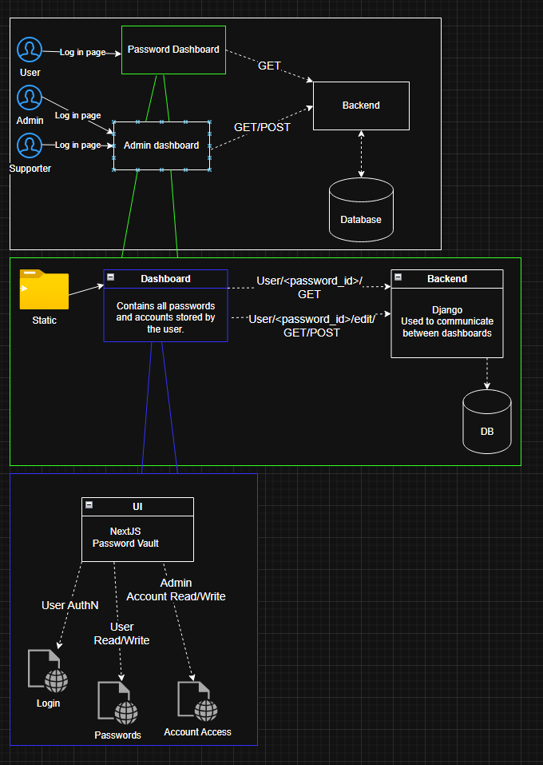

# User Stories
As a **user**, I want to **securely store my passwords** so I can **easily access and add passwords**  
As an **admin**, I want to **be able to view and manage logs** so I can **watch for misuse and would be able to deactivate/delete malicious user accounts**. (Additional note: admins will **not** be able to see users' passwords.) 
As a **developer**, I want to **update and maintain the code** so I can **keep the users's passwords secure**. 
As a **support role**, I want to **be able to reset users' passwords if they forget them** so **the user can have access to their password vault**.

# Acceptance Criteria
As a **user**, the acceptance criteria would be **not allowing other users to see my passwords**. 
As an **admin**, the acceptance criteria would be **the ability to delete or deactivate users' accounts without being able to see their passwords**. 
As a **developer**, the acceptance criteria would be **regularly maintaining and updating the code**. 
As a **support role**, the acceptance criteria would be **being able to reset users' passwords and getting them access back into their vaults**. 

# Mis-user Stories
As an **attacker**, I want to **access other users' passwords** so I can **steal their passwords**. 
As an **attacker**, I want to **change other users' stored passwords** so I can **cause chaos**. 
As an **attacker**, I want to **change other users' account emails and passwords** so I can **potentially ransom their account**. 
As an **attacker**, I want to **access other users' passwords** so I can **sell access to their accounts**. 
As an **attacker**, I want to **brute force a user's password** so I can **gain access to their acccount**. 
As an **attacker**, I want to **inject code into any available textbox** so I can **gain access to things I shouldn't be able to access**.

# Mitigation Criteria
In order to prevent an **attacker** from **accessing other users' passwords**, I want to use **authentication of users**. 
In order to prevent an **attacker** from **changing other users' passwords**, I think using **authentication** will still prevent malicious action to users' accounts. 
In order to prevent an **attacker from brute forcing a user's password**, **implementing some way to check for repeated password attmepts will help mitigate their ability to brute force a password**. 
In order to prevent an **attacker from attempting to use an XSS attack**, I will be **sanitizing a user's input or limiting what characters they can use**. (All user input is evil)

# Mockup

# C4 Model Drawups

